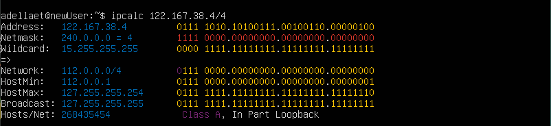
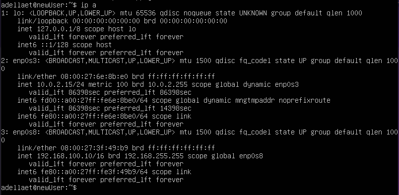
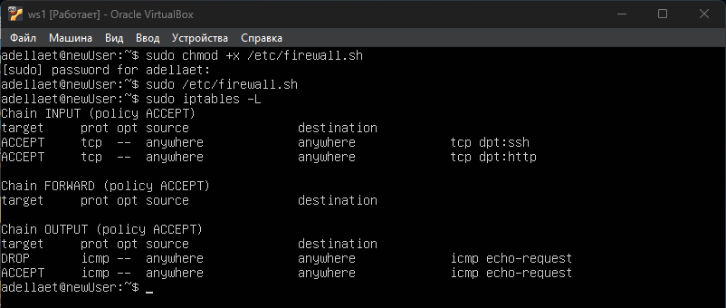
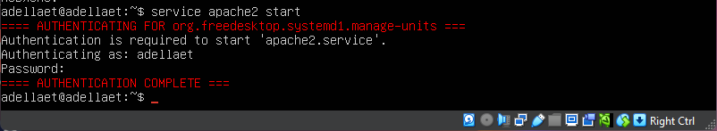

<h2>Part 1. Инструмент ipcalc</h2>
<h3>1.1 Сети и маски</h3>

1)адрес сети 192.167ю38.54/13

2)перевод маски 255.255.255.0 в префиксную и двоичную запись, /15 в обычную и двоичную, 11111111.11111111.11111111.11110000 в обычную и префиксную

255:

15:

11111111.11111111.11111111.11110000:

3)минимальный и максимальный хост в сети 122.167.38.4 при масках:

/8:

11111111.11111111.00000000.00000000:

255.255.254.0:

/4:

<h3>1.2. localhost</h3>

Определить и записать в отчёт, можно ли обратиться к приложению, работающему на localhost, со следующими IP: 194.34.23.100, 127.0.0.2, 127.1.0.1, 128.0.0.1

можно:

127.0.0.2,

127.1.0.1

нельзя:

194.34.23.100,

128.0.0.1

Так как localhost находится в диапазоне 127.0.0.1 — 127.255.255.254

<h3>1.3. Диапазоны и сегменты сетей</h3>

1)какие из перечисленных IP можно использовать в качестве публичного, а какие только в качестве частных:

частные входят в следующие диапазоны:

10.0.0.0 — 10.255.255.255

100.64.0.0 — 100.127.255.255

172.16.0.0 — 172.31.255.255

192.168.0.0 — 192.168.255.255

остальные являются публиными.

10.0.0.45 -частный

134.43.0.2-публичный

192.168.4.2-частный

172.20.250.4-частный

172.0.2.1-публичный

192.172.0.1-публичный

172.68.0.2-публичный

172.16.255.255-частный

10.10.10.10-частный

192.169.168.1-публичный

2)какие из перечисленных IP адресов шлюза возможны у сети 10.10.0.0/18:

должно находиться в диапазоне 10.10.0.1-10.10.63.254

10.0.0.1-не подходит

10.10.0.2-подходит

10.10.10.10-подходит

10.10.100.1-не подходит

10.10.1.255-подходит

<h2>Part 2. Статическая маршрутизация между двумя машинами</h2>

Поднять две виртуальные машины (далее -- ws1 и ws2)

С помощью команды ip a посмотреть существующие сетевые интерфейсы

Описать сетевой интерфейс, соответствующий внутренней сети, на обеих машинах и задать следующие адреса и маски: ws1 - 192.168.100.10, маска /16, ws2 - 172.24.116.8, маска /12

ws1:

изменение netplan

сохранение изменений

после сохранений

ws2:

изменение netplan

сохранение изменений

после сохранений 

<h3>2.1. Добавление статического маршрута вручную</h3>

Добавить статический маршрут от одной машины до другой и обратно при помощи команды вида ip r add

Пропинговать соединение между машинами

<h3>2.2. Добавление статического маршрута с сохранением</h3>

Добавить ста угой с помощью файла etc/netplan/00-installer-config.yaml

Пропинговать соединение между машинами

<h2>Part 3. Утилита iperf3</h2>
<h3>3.1. Скорость соединения</h3>

Перевести и записать в отчёт:

8 Mbps = 1 MB/s(мегабит/c в мегабайт/c)

100 MB/s = 819200 Kbps(мегабайт/c в килобит/c)

1 Gbps = 1024 Mbps(гигабит/c в мегабит/c)

3.2. Утилита iperf3
Измерить скорость соединения между ws1 и ws2

<h2>Part 4. Сетевой экран</h2>
<h3>4.1. Утилита iptables</h3>

Создать файл /etc/firewall.sh, имитирующий фаерволл, на ws1 и ws2:

Нужно добавить в файл подряд следующие правила:

1)на ws1 применить стратегию когда в начале пишется запрещающее правило, а в конце пишется разрешающее правило (это касается пунктов 4 и 5)

2)на ws2 применить стратегию когда в начале пишется разрешающее правило, а в конце пишется запрещающее правило (это касается пунктов 4 и 5)

3)открыть на машинах доступ для порта 22 (ssh) и порта 80 (http)

4)запретить echo reply (машина не должна "пинговаться”, т.е. должна быть блокировка на OUTPUT)

5)разрешить echo reply (машина должна "пинговаться")

Запустить файлы на обеих машинах командами chmod +x /etc/firewall.sh и /etc/firewall.sh

Разница в том, что команды выполняются по порядку. Поэтому в ws1 пинг будет запрещен(потому что разрешение стоит после запрещения), а в ws2 будет разрешен, так как разрешение стоит первее.

<h3>4.2. Утилита nmap</h3>

Командой ping найти машину, которая не "пингуется", после чего утилитой nmap показать, что хост машины запущен Проверка: в выводе nmap должно быть сказано: Host is up

В отчёт поместить скрины с вызовом и выводом использованных команд ping и nmap.

Сохранить дампы образов виртуальных машин

<h2>Part 5. Статическая маршрутизация сети</h2>

Поднять пять виртуальных машин (3 рабочие станции (ws11, ws21, ws22) и 2 роутера (r1, r2))

Настроить конфигурации машин в etc/netplan/00-installer-config.yaml согласно сети на рисунке.

Перезапустить сервис сети. Если ошибок нет, то командой ip -4 a проверить, что адрес машины задан верно.

Перезапуск командой: sudo systemctl restart NetworkManager

Также пропинговать ws22 с ws21. Аналогично пропинговать r1 с ws11.

<h3>5.2. Включение переадресации IP-адресов.</h3>

Для включения переадресации IP, выполните команду на роутерах: sysctl -w net.ipv4.ip_forward=1

Откройте файл /etc/sysctl.conf и добавьте в него следующую строку: net.ipv4.ip_forward = 1

<h3>5.3. Установка маршрута по-умолчанию</h3>

Настроить маршрут по-умолчанию (шлюз) для рабочих станций. Для этого добавить default перед IP роутера в файле конфигураций

Вызвать ip r и показать, что добавился маршрут в таблицу маршрутизации

Пропинговать с ws11 роутер r2 и показать на r2, что пинг доходит. Для этого использовать команду: tcpdump -tn -i eth1

<h3>5.4. Добавление статических маршрутов</h3>

Добавить в роутеры r1 и r2 статические маршруты в файле конфигураций

Вызвать ip r и показать таблицы с маршрутами на обоих роутерах.

Запустить команды на ws11: ip r list 10.10.0.0/[маска сети] и ip r list 0.0.0.0/0

объяснить, почему для адреса 10.10.0.0/[маска сети] был выбран маршрут, отличный от 0.0.0.0/0, хотя он попадает под маршрут по-умолчанию:

был выбран первый, так как он прописал в нетпане+выбирается тот вариант, где маска длиннее

<h3>5.5. Построение списка маршрутизаторов</h3>

Запустить на r1 команду дампа: tcpdump -tnv -i eth0

<h3>5.6. Использование протокола ICMP при маршрутизации</h3>

Запустить на r1 перехват сетевого трафика, проходящего через eth0 с помощью команды: tcpdump -n -i eth0 icmp

Пропинговать с ws11 несуществующий IP (например, 10.30.0.111) с помощью команды: ping -c 1 10.30.0.111

Сохранить дампы образов виртуальных машин

<h2>Part 6. Динамическая настройка IP с помощью DHCP</h2>

Для r2 настроить в файле /etc/dhcp/dhcpd.conf конфигурацию службы DHCP:

1)указать адрес маршрутизатора по-умолчанию, DNS-сервер и адрес внутренней сети.

2)в файле resolv.conf прописать nameserver 8.8.8.8.

Перезагрузить службу DHCP командой systemctl restart isc-dhcp-server. Машину ws21 перезагрузить при помощи reboot и через ip a показать, что она получила адрес. Также пропинговать ws22 с ws21.

Указать MAC адрес у ws11, для этого в etc/netplan/00-installer-config.yaml надо добавить строки: macaddress: 10:10:10:10:10:BA, dhcp4: true

Для r1 настроить аналогично r2, но сделать выдачу адресов с жесткой привязкой к MAC-адресу (ws11). Провести аналогичные тесты

Запросить с ws21 обновление ip адреса

Сохранить дампы образов виртуальных машин

sudo dhclient -r -удалить ip sudo dhclient -v -добавить ip

<h2>Part 7. NAT</h2>

В файле /etc/apache2/ports.conf на ws22 и r1 изменить строку Listen 80 на Listen 0.0.0.0:80, то есть сделать сервер Apache2 общедоступным

Запустить веб-сервер Apache командой service apache2 start на ws22 и r1

Добавить в фаервол, созданный по аналогии с фаерволом из Части 4, на r2 следующие правила:

1)удаление правил в таблице filter - iptables -F

2)удаление правил в таблице "NAT" - iptables -F -t nat

3)отбрасывать все маршрутизируемые пакеты - iptables --policy FORWARD DROP

Запускать файл также, как в Части 4

Проверить соединение между ws22 и r1 командой ping

При запуске файла с этими правилами, ws22 не должна "пинговаться" с r1

Добавить в файл ещё одно правило:

4)разрешить маршрутизацию всех пакетов протокола ICMP

Запускать файл также, как в Части 4

Проверить соединение между ws22 и r1 командой ping

При запуске файла с этими правилами, ws22 должна "пинговаться" с r1

Добавить в файл ещё два правила:

5)включить SNAT, а именно маскирование всех локальных ip из локальной сети, находящейся за r2 (по обозначениям из Части 5 - сеть 10.20.0.0) Совет: стоит подумать о маршрутизации внутренних пакетов, а также внешних пакетов с установленным соединением

6)включить DNAT на 8080 порт машины r2 и добавить к веб-серверу Apache, запущенному на ws22, доступ извне сети

Проверить соединение по TCP для SNAT, для этого с ws22 подключиться к серверу Apache на r1 командой: telnet [адрес] [порт]

Проверить соединение по TCP для DNAT, для этого с r1 подключиться к серверу Apache на ws22 командой telnet (обращаться по адресу r2 и порту 8080)

Сохранить дампы образов виртуальных машин

<h2>Part 8. Дополнительно. Знакомство с SSH Tunnels</h2>

Запустить на r2 фаервол с правилами из Части 7:

sudo chmod +x /etc/firewall.sh

sudo /etc/firewall.sh

Запустить веб-сервер Apache на ws22 только на localhost (то есть в файле /etc/apache2/ports.conf изменить строку Listen 80 на Listen localhost:80)

Воспользоваться Local TCP forwarding с ws21 до ws22, чтобы получить доступ к веб-серверу на ws22 с ws21

ssh -L local_port:destination:destination_port ssh_server

Воспользоваться Remote TCP forwarding c ws11 до ws22, чтобы получить доступ к веб-серверу на ws22 с ws11

ssh -R remote_port:destination:destination_port ssh_server

Для проверки, сработало ли подключение в обоих предыдущих пунктах, перейдите во второй терминал (например, клавишами Alt + F2) и выполните команду: telnet 127.0.0.1 [локальный порт]

Сохранить дампы образов виртуальных машин

